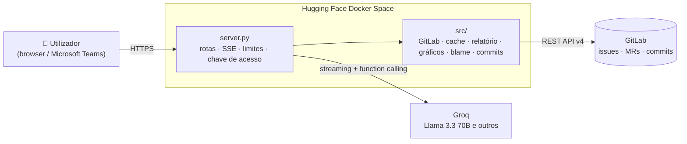

<div align="center">

# 🤖 SprintLab Chatbot

**Assistente de IA para projetos GitLab — pergunta, analisa e gere issues em linguagem natural.**

Trabalho Final de Curso · Licenciatura em Engenharia Informática · Universidade Lusófona


</div>

---

## ✨ O que faz

O SprintLab Chatbot junta, numa conversa, tudo o que normalmente está espalhado pelo GitLab: issues, milestones, commits, merge requests e código. Responde com **dados reais do projeto** e executa ações **sempre com confirmação**.

| | Funcionalidade | Exemplo |
|---|---|---|
| 💬 | **Perguntas em linguagem natural** com o contexto vivo do projeto | *"quantas issues estão abertas?"* |
| 📊 | **Relatório do projeto 100% determinístico** — nenhum número é inventado pela IA | *"faz um relatório do projeto"* |
| 📈 | **9 gráficos inline** (estado, assignee, label, milestone, burndown, cycle time, MRs, commits…) | *"mostra o burndown"* |
| ✅ | **Gestão de issues** — criar, editar, fechar e apagar, com cartão de confirmação | *"fecha a issue 12"* |
| 🔍 | **Investigação de código** — *git blame* + histórico + explicação pela IA | *"quem alterou o server.py linha 40?"* |
| 🌿 | **Commits por IA** — sempre numa branch `ai/*` + Merge Request, nunca na `main` | *"faz commit de uma função soma em utils.py"* |
| 📁 | **Exportação CSV** de issues e commits | *"exporta os commits para csv"* |
| 🗂️ | **Vários GitLabs** (gitlab.com ou self-managed), cada um com o seu chat | botão **+ Adicionar GitLab** |
| 🌗 | **Tema automático** — claro de dia, preto (OLED) à noite | ⚙️ Definições |

## 🏗️ Arquitetura



- **Backend 100% biblioteca padrão de Python** — sem frameworks nem dependências em runtime.
- **Frontend** em HTML/CSS/JS puro (`chatbox.html`, `style.css`, `app.js`), com Chart.js por CDN (com *Subresource Integrity*).
- **Streaming** das respostas por Server-Sent Events, com *fallback* automático de modelo quando a quota acaba.

## 🔒 Segurança e robustez

- **Escritas protegidas** — com o token do servidor, criar/editar/fechar/apagar issues e commits por IA exigem uma **chave de acesso** (`APP_ACCESS_KEY`). Sem ela, ficam desligadas.
- **O token do servidor nunca sai** para outra instância ou projeto indicado pelo cliente.
- **Proteção SSRF** — instâncias personalizadas só em `https://` e endereços públicos (incl. IPv4 escondido em IPv6), DNS reverificado na ligação, redirecionamentos recusados.
- **Commits por IA** com `[skip ci]` e sem poder alterar `.gitlab-ci.yml`.
- **Limites** por IP (taxa e concorrência), prazos totais (também em HTTPS) e tamanho máximo nas respostas do GitLab, *threads* repartidas entre o GitLab do servidor e os dos utilizadores.
- **Content-Security-Policy** na página e cache segmentada por token.

## 🚀 Começar

### Correr localmente

```bash
git clone https://github.com/BernardoGouveia/sprintlab-chatbot.git
cd sprintlab-chatbot
```

```powershell
$env:GROQ_API_KEY="gsk_..."        # https://console.groq.com/keys (grátis)
$env:GITLAB_TOKEN="glpat-..."
$env:APP_ACCESS_KEY="uma-chave"    # para testar as escritas
$env:PORT="8080"
python server.py                   # abre http://localhost:8080
```

### Deploy no Hugging Face Spaces

1. Cria um Space **Docker** (Blank).
2. Envia `Dockerfile`, `.dockerignore`, `server.py`, a pasta **`src/`**, `chatbox.html`, `style.css`, `app.js`, `README.md` e `requirements.txt`.
3. Em *Settings → Variables and secrets* define `GROQ_API_KEY`, `GITLAB_TOKEN` e `APP_ACCESS_KEY`.
4. O Space faz build e fica em `https://<user>-<space>.hf.space` — aponta o `manifest.json` do Teams para esse URL.

Todas as variáveis de ambiente estão documentadas no [README da raiz](../README.md#variáveis-de-ambiente).

## 🧪 Testes

```bash
python -m pip install -r requirements-dev.txt
python -m pytest              # 506 testes — unitários + integração HTTP, sem rede
node tests/route_harness.mjs  # 49 casos de routing de intenções do frontend
```

Os testes arrancam um **servidor HTTP real** e simulam apenas o GitLab e a Groq, por isso todo o resto (rotas, cache, agregação, segurança) é o código de produção.

## 📂 Estrutura

```
├── server.py            # entrypoint HTTP: rotas, streaming SSE, limites, chave de acesso
├── src/
│   ├── config.py        # configuração (fail-fast) e prompts
│   ├── gitlab_api.py    # cliente GitLab: multi-tenant, SSRF, prazos, paginação
│   ├── analytics.py     # estatísticas, contexto do LLM, CSV
│   ├── report.py        # relatório determinístico
│   ├── charts.py        # dados dos gráficos (Chart.js)
│   ├── blame.py         # investigação de código
│   ├── code_commit.py   # commits por IA (branch + MR)
│   ├── actions.py       # escritas em issues (validadas)
│   ├── read_tools.py    # ferramentas de leitura do modelo
│   ├── llm.py           # cliente Groq
│   └── cache.py · rate_limiter.py · threading_server.py
├── chatbox.html · style.css · app.js   # frontend
├── tests/               # pytest + harness de routing (Node)
├── relatorio/           # relatório do TFC (Markdown + diagramas)
└── Dockerfile
```

## 👤 Autor

**Bernardo Gouveia** — Licenciatura em Engenharia Informática, Universidade Lusófona.
