# Anexo — Calendário do Projeto (Gantt)

> Datas de **exemplo** para um TFC 2025/2026 — **ajusta** às tuas reais. A tabela serve de
> base à Figura/Tabela do calendário; o bloco PlantUML no fim gera o gráfico de Gantt.

## Tabela de tarefas

| ID | Tarefa | Fase | Início | Fim |
|----|--------|------|--------|-----|
| T1 | Identificação do problema | 1 — Levantamento e Análise | 2025-09-15 | 2025-09-26 |
| T2 | Benchmarking | 1 — Levantamento e Análise | 2025-09-22 | 2025-10-03 |
| T3 | Questionário de viabilidade | 1 — Levantamento e Análise | 2025-09-29 | 2025-10-17 |
| T4 | Levantamento de requisitos (MoSCoW) | 1 — Levantamento e Análise | 2025-10-13 | 2025-10-24 |
| T5 | Diagramas (casos de uso, BPMN, sequência) | 2 — Conceção | 2025-10-27 | 2025-11-14 |
| T6 | Modelo de dados | 2 — Conceção | 2025-11-10 | 2025-11-17 |
| T7 | Mockups e arquitetura | 2 — Conceção | 2025-11-17 | 2025-11-28 |
| T8 | Servidor HTTP + integração GitLab API | 3 — Implementação (núcleo) | 2025-12-01 | 2025-12-19 |
| T9 | Chat em linguagem natural + function calling | 3 — Implementação (núcleo) | 2025-12-15 | 2026-01-16 |
| T10 | Migração para Groq + Hugging Face Space | 3 — Implementação (núcleo) | 2026-01-12 | 2026-01-23 |
| T11 | Gráficos (Chart.js) | 4 — Análise e visualização | 2026-01-26 | 2026-02-06 |
| T12 | Relatório do projeto + painel de estatísticas | 4 — Análise e visualização | 2026-02-02 | 2026-02-20 |
| T13 | Arquitetura multi-tenant + integração Teams | 4 — Análise e visualização | 2026-02-16 | 2026-03-06 |
| T14 | Investigação de código (git blame + IA) | 5 — Funcionalidades avançadas | 2026-03-09 | 2026-03-27 |
| T15 | Geração de código por IA (commit + Merge Request) | 5 — Funcionalidades avançadas | 2026-03-23 | 2026-04-10 |
| T16 | Suíte de testes automatizados | 6 — Testes e validação | 2026-04-13 | 2026-05-01 |
| T17 | Validação funcional (4 GitLabs) | 6 — Testes e validação | 2026-04-27 | 2026-05-08 |
| T18 | Deploy e documentação | 7 — Entrega | 2026-05-11 | 2026-05-22 |
| T19 | Relatório final | 7 — Entrega | 2026-05-18 | 2026-06-12 |
| T20 | Vídeo de demonstração e entrega | 7 — Entrega | 2026-06-08 | 2026-06-15 |
| T21 | Revisão de segurança e qualidade (77 + 49 problemas corrigidos) | 6 — Testes e validação | 2026-09-17 | 2026-10-01 |

> **Nota:** a T21 tem datas **reais** (17–30 set. 2026); as restantes datas desta tabela são de
> exemplo e o autor deve reconciliá-las com o calendário real — em particular, o relatório final
> (T19) e a entrega (T20/«Entrega Final») têm de terminar depois da T21 (no gráfico abaixo, por
> exemplo, `[Entrega Final] happens at [T21]'s end` ou a data real de entrega).

## Gráfico de Gantt (PlantUML)

> Cola em **https://www.plantuml.com/plantuml/uml/** para gerar o gráfico. Ajusta a data
> `project starts` e as durações conforme a tua tabela.

```plantuml
@startgantt
project starts 2025-09-15
saturday are closed
sunday are closed

-- Fase 1 · Levantamento e Análise --
[Identificação do problema] as [T1] lasts 10 days
[Benchmarking] as [T2] lasts 10 days
[T2] starts at [T1]'s start
[Questionário de viabilidade] as [T3] lasts 15 days
[Requisitos (MoSCoW)] as [T4] lasts 10 days
[T4] starts at [T3]'s end

-- Fase 2 · Conceção --
[Diagramas (UC, BPMN, seq.)] as [T5] lasts 15 days
[T5] starts at [T4]'s end
[Modelo de dados] as [T6] lasts 6 days
[Mockups e arquitetura] as [T7] lasts 8 days
[T7] starts at [T5]'s end

-- Fase 3 · Implementação (núcleo) --
[Servidor + GitLab API] as [T8] lasts 14 days
[T8] starts at [T7]'s end
[Chat NL + function calling] as [T9] lasts 22 days
[T9] starts at [T8]'s end
[Migração Groq + HF Space] as [T10] lasts 9 days
[T10] starts at [T9]'s end

-- Fase 4 · Análise e visualização --
[Gráficos] as [T11] lasts 10 days
[T11] starts at [T10]'s end
[Relatório + estatísticas] as [T12] lasts 14 days
[T12] starts at [T11]'s end
[Multi-tenant + Teams] as [T13] lasts 14 days
[T13] starts at [T12]'s end

-- Fase 5 · Funcionalidades avançadas --
[Git blame + análise IA] as [T14] lasts 14 days
[T14] starts at [T13]'s end
[Commit por IA + MR] as [T15] lasts 14 days
[T15] starts at [T14]'s end

-- Fase 6 · Testes e validação --
[Testes automatizados] as [T16] lasts 14 days
[T16] starts at [T15]'s end
[Validação (4 GitLabs)] as [T17] lasts 9 days
[T17] starts at [T16]'s end
[Revisão de segurança e qualidade] as [T21] starts 2026-09-17
[T21] ends 2026-10-01

-- Fase 7 · Entrega --
[Deploy e documentação] as [T18] lasts 9 days
[T18] starts at [T17]'s end
[Relatório final] as [T19] lasts 18 days
[T19] starts at [T18]'s end
[Vídeo e entrega] as [T20] lasts 5 days
[T20] starts at [T19]'s end

[Entrega Final] happens at [T20]'s end
@endgantt
```

> **Nota sobre os desvios (para a secção 7 — Método e Planeamento):** referir que a fase 3
> sofreu a alteração de infraestrutura (Ollama→Groq, ngrok→Hugging Face) e que a fase 6
> (testes) exigiu mais tempo do que o estimado — coerente com o texto da secção 7.
