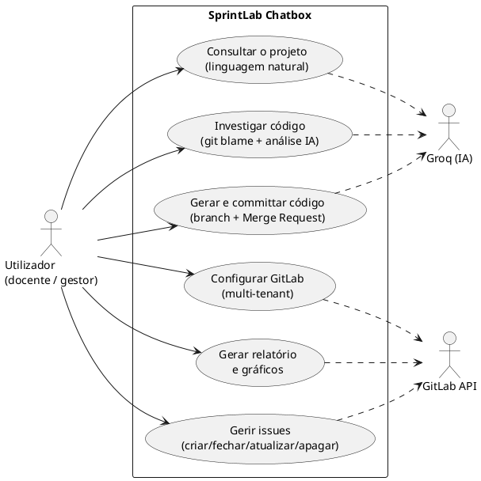
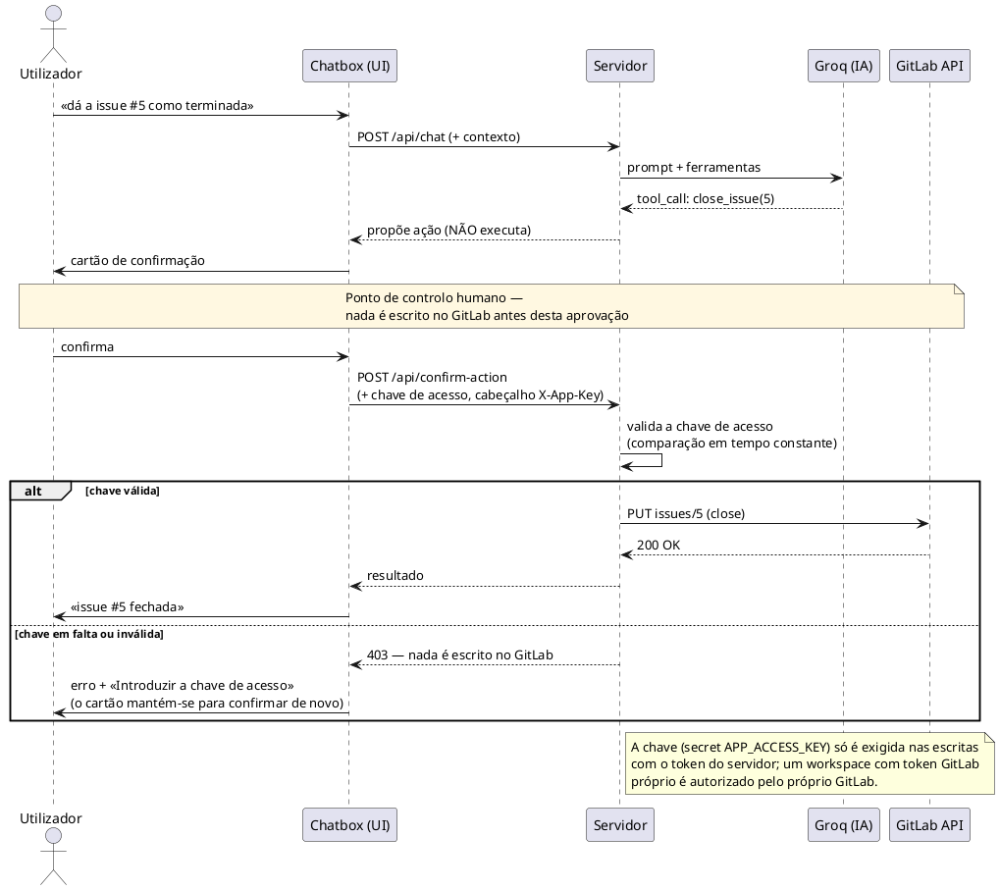
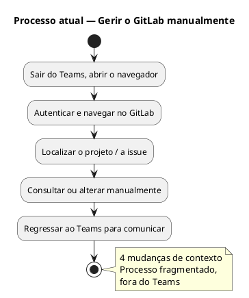
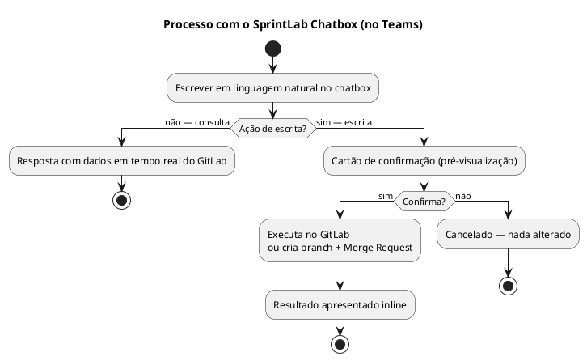
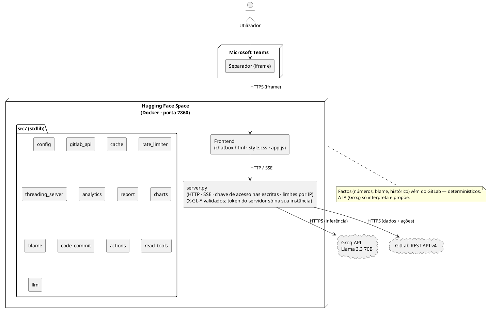
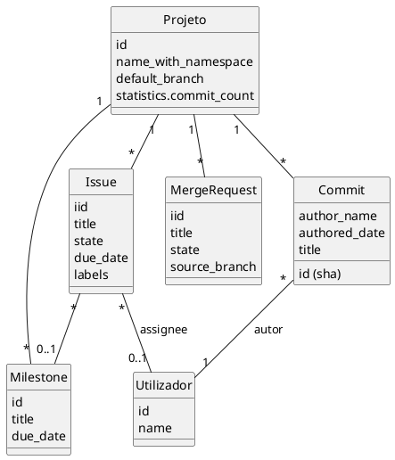

# Diagramas em PlantUML

Código-fonte PlantUML de cada diagrama. **Como usar:** copia cada bloco (de `@startuml` a
`@enduml`) e cola em:
- **https://www.plantuml.com/plantuml/uml/** (renderiza online, exporta PNG/SVG), ou
- a extensão **PlantUML** no VS Code (pré-visualização local), ou
- **draw.io** (Arrange → Insert → Advanced → PlantUML).

> Vantagem do PlantUML: produz diagramas com o aspeto "UML standard" que os avaliadores
> reconhecem, e são fáceis de editar (é texto). Os ficheiros `.svg` que já tens servem se
> preferires o visual personalizado; estes são a alternativa editável.

---

## 1. Diagrama de Casos de Uso

---

## 2. Diagrama de Sequência — Ação com confirmação

> Frases simples como «fecha a issue 5» são reconhecidas diretamente pelo *frontend*, que abre
> o mesmo cartão sem passar pelo modelo (sem `POST /api/chat` nem chamada à Groq); o passo de
> confirmação é idêntico.

---

## 3. Diagrama de Atividade — Processo As-Is (atual)

---

## 4. Diagrama de Atividade — Processo To-Be (com o SprintLab)

---

## 5. Diagrama de Arquitetura (componentes / *deployment*)

---

## 6. (Extra) Modelo de dados — entidades do GitLab usadas

> Para a secção 4.4 (Modelos relevantes). O SprintLab não tem base de dados própria —
> consome as entidades do GitLab. Este diagrama de classes documenta-as.

